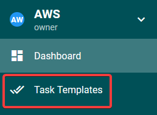
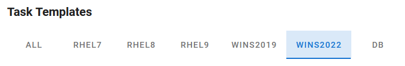
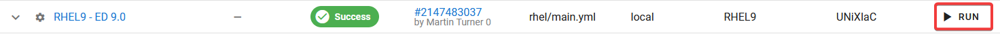
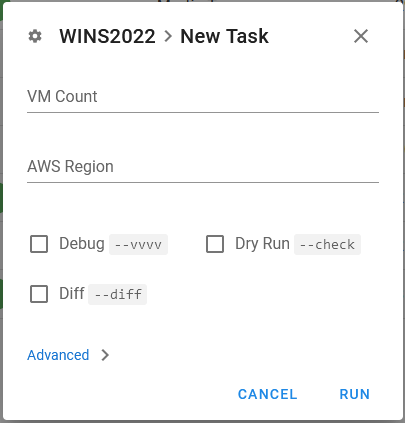
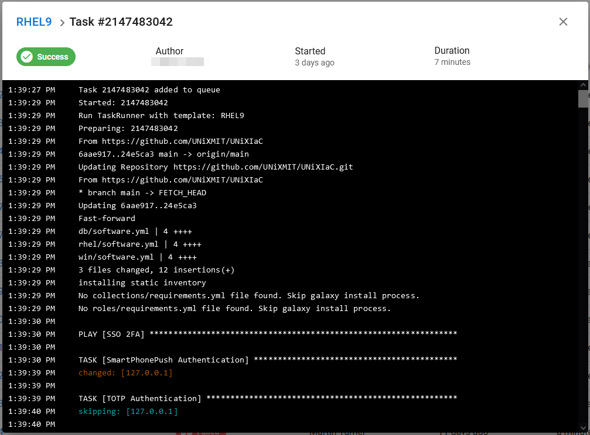
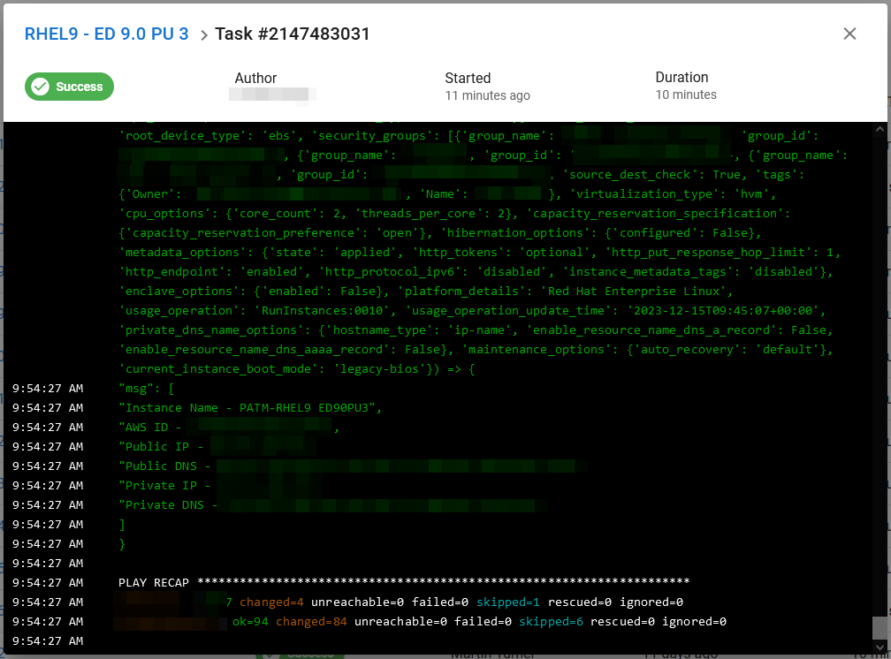

# [UNiXIaC](https://github.com/UNiXMIT/UNiXIaC)
# Ansible Semaphore Documentation

- [AWS Instance Creation](#aws-instance-creation)
    - [Additional Details](#additional-details)
- [Supported Products](#supported-os--products)

## AWS Instance Creation
1. After logging in, navigate to the 'Task Templates' in the nav bar on the left hand side.   
  

2. Along the top you will see a list of OS versions to filter tasks by OS. There is also a 'DB' filter for databases and other services.  
  

3. To start a task, click the 'RUN' button on the right side of the row for the Task you want to execute.  
  

4. You will now see a pop-up window showing 5 entry fields. Only the first 2, SSO Email and password, are required fields.  
    - SSO Email - Micro Focus Email to authenticate with Pulse VPN.  
    - SSO Password - Micro Focus Password to Authenticate with Pulse VPN.  
    - SSO Method - SSO Authentication method to use. 1=SmartPhonePush 2=TOTP (default=1).  
    - SSO Token - Valid authentication token to use for TOTP.  
    - VM Count - Number of duplicate EC2 instances to create (default=1).  
  

    > **NOTE:** Unless you are creating and testing new Tasks, there is no need to check any of the checkboxes at the bottom.  

5. A Task Console window will appear, while the EC2 instance is being created.  
   You can safely close the browser now or leave it open to monitor its creation.  If you want to come back to the task later to check progress, take note of the Task number. When you return, open the Dashboard and click on the 'History' tab. The find your Task and click the Task number to re-open the Task console.  

6. Once the Task has completed and is marked as a 'Success', scroll to the very bottom of the Task console an you will see the EC2 Instance details like public IP/DNS and database connection information.  

> **NOTE:** If a task fails, check the Task console to see where it has failed. If it failed on SSO authentication try again or check that 2FA is still working elsewhere.  
> If it failed elsewhere in the script, report the issue (including the Task number) to an admin to check the problem.  

### Additional Details
- Windows EC2 instances are accessible via RDP using the 'support' user and the usual password.  
- Linux EC2 Instances are accessible via SSH using the 'support' user and the usual password. 
- The DB tasks create services in Podman containers, running on RHEL EC2 Instances. They are meant for quick deployment of a service for testing, then they can be removed.   
> **NOTE:** If in doubt, try the usual password or contact an admin.  
- Instances are created with a 120GB SSD, 4vCPUs, 16GiB Memory and 3.1 GHz Clock Speed (t3.xlarge).  
- Instances are created with your username, OS and products name as Instance name.  
- Tags are added to the instance to show what products have been installed and what installers were used.  
- Instances are all set to shutdown at 8pm GMT to encourage users not to leave instances running for no reason. If a instance really needs to stay on longer, the auto shutdown can be disabled from either the task scheduler (Windows) or the root cron job (Linux).  

## Supported OS / Products
### Windows Server 2022
- ED/ES 6.0, 7.0, 8.0 and 9.0   
- AcuCOBOL-GT extend 10.4.0, 10.4.1, 10.5.0 and 10.5.1  

### Windows Server 2019
- ED/ES 5.0  

### RHEL 9
- ED 7.0, 8.0 and 9.0  
- AcuCOBOL-GT extend 10.4.0, 10.4.1, 10.5.0 and 10.5.1  

### RHEL 8
- ED 6.0 and 7.0  

### RHEL 7
- ED 5.0

### SLES 15
- ED 9.0
- AcuCOBOL-GT extend 10.4.0, 10.4.1, 10.5.0 and 10.5.1  

### Ubuntu 22.04
- ED 9.0
- AcuCOBOL-GT extend 10.4.0, 10.4.1, 10.5.0 and 10.5.1  

> **NOTE:** Patch Updates will be added as they become GA.  

### Licenses
ED/ES and AcuCOBOL-GT extend are all licensed, ready to use.  

### Security
ED/ES 7.0, 8.0 and 9.0 tasks will also install and setup ADLDS (Windows) OpenLDAP (Linux).  
The connection details are automatically added into ESCWA using the API.  

#### ADLDS
BASE DN - CN=Micro Focus,CN=Program Data,DC=local  
Authorized ID - CN=MFReader,CN=ADAM Users,CN=Micro Focus,CN=Program Data,DC=local  
LDAP URL - ldap://localhost:389  

#### OpenLDAP
BASE DN - cn=Micro Focus,dc=secldap,dc=com   
Authorized ID - cn=Manager,dc=secldap,dc=com  
LDAP URL - ldap://localhost:389  

### ODBC Drivers/Libraries
- SQL Server ODBC
- Oracle Instant Client
- PostgreSQL ODBC
- DB2 (for XA and ODBC) 

### VPN
- PulseVPN (Windows)
- OpenConnect (Linux)

### Databases
- DB2 11.5 Community Edition  
- IBM MQ 9.3 
- Informix 14.10 Developer Edition 
- MySQL Server 8 Community Edition 
- Oracle 23c Free 
- PostgreSQL 16.1 
- Redis 7 
- SQL Server 2022 
- Sybase 16.2 
- OpenLDAP for ES